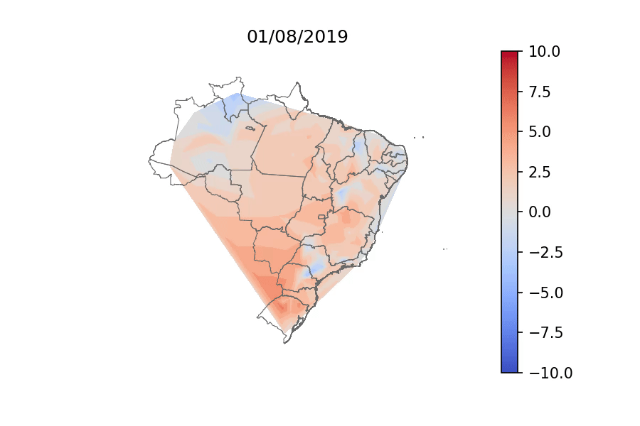
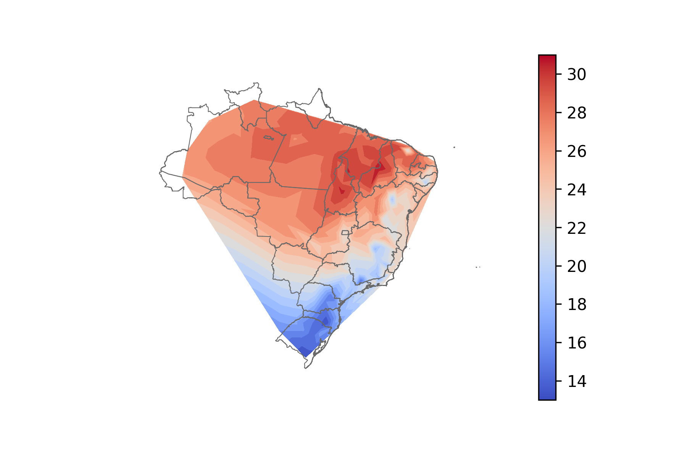
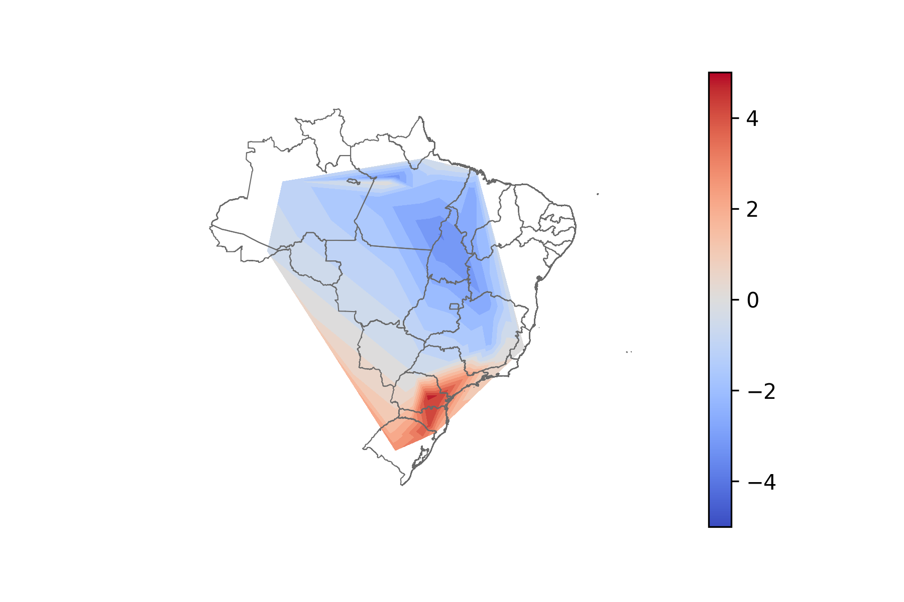
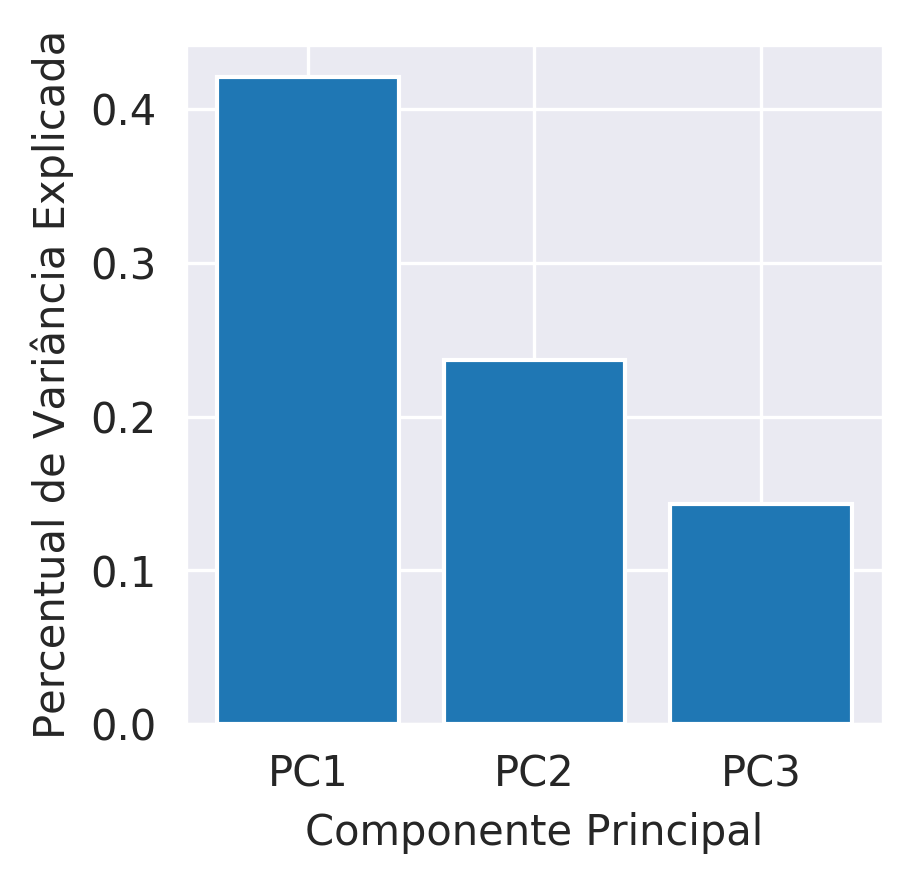
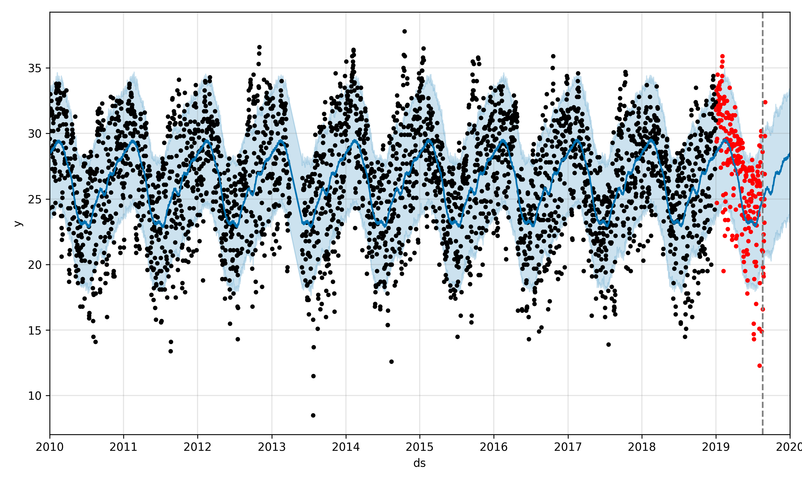
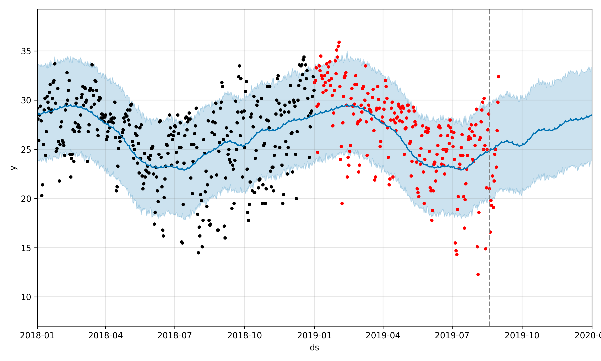
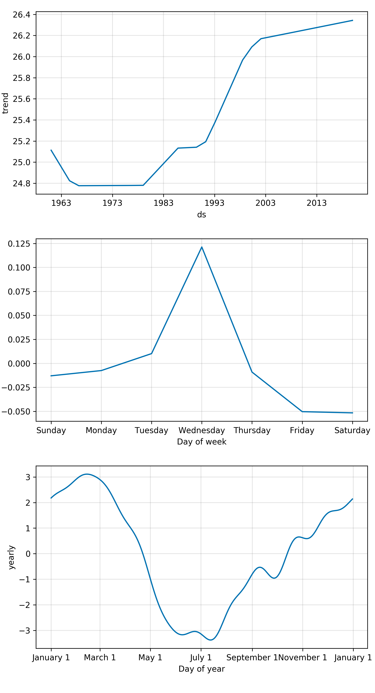

## Mídia

### GIF `tair`−*baseline* (° C)

### *Baseline* agosto 1970—2018 (° C)

### PC1 de 19/08/2019 na base PCA 1970—2019

### *Scree plot*

### *Forecast* `tmax` 2019 — janela de 10 anos

### *Forecast* `tmax` 2019 — janela de 2 anos

### Parâmetros `fbprophet` (GAM 1970—2018)

Ver Taylor e Letham [1] para mais informações.

[1] Taylor SJ, Letham B. 2017. Forecasting at scale. *PeerJ Preprints* 5:e3190v2 <https://doi.org/10.7287/peerj.preprints.3190v2>
